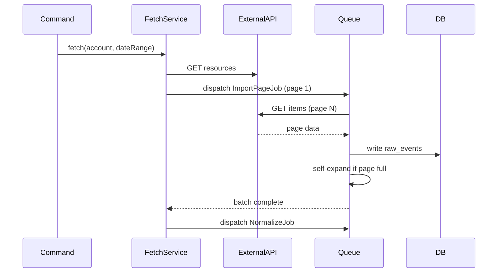

# API Design Examples

Concrete examples supporting `../SKILL.md`. All examples use a hypothetical
"Calendar" app domain; adapt names to the actual project.

## Resource inventory example

| Resource | Type | Owner | Access | Notes |
|----------|------|-------|--------|-------|
| Calendar | Primary | User | Auth | CRUD + sharing |
| Template | Primary | System | Public (read), Admin (write) | Pre-built calendar templates |
| Entry | Sub-resource of Calendar | User | Auth | Daily completion entries |
| Report | Computed | User | Auth | Read-only aggregations |
| Subscription | Primary | User | Auth | Payment-provider managed |

## Endpoint tables

### Calendars (standard CRUD)

| Method | Path | Description | Auth | Notes |
|--------|------|-------------|------|-------|
| GET | /api/v1/calendars | List user's calendars | Bearer | Paginated, filterable |
| POST | /api/v1/calendars | Create a calendar | Bearer | From template or custom |
| GET | /api/v1/calendars/{calendar} | Get calendar details | Bearer | Owner only |
| PATCH | /api/v1/calendars/{calendar} | Update calendar | Bearer | Owner only |
| DELETE | /api/v1/calendars/{calendar} | Soft-delete calendar | Bearer | Owner only |

### Calendar entries (sub-resource)

| Method | Path | Description | Auth | Notes |
|--------|------|-------------|------|-------|
| GET | /api/v1/calendars/{calendar}/entries | List entries | Bearer | Filterable by date range |
| POST | /api/v1/calendars/{calendar}/entries | Create entry | Bearer | Mark completion |
| PATCH | /api/v1/calendars/{calendar}/entries/{entry} | Update entry | Bearer | Change status |
| DELETE | /api/v1/calendars/{calendar}/entries/{entry} | Delete entry | Bearer | Undo completion |

### Non-CRUD actions

| Method | Path | Description | Auth | Notes |
|--------|------|-------------|------|-------|
| POST | /api/v1/calendars/{calendar}/duplicate | Duplicate calendar | Bearer | Creates copy |
| POST | /api/v1/calendars/{calendar}/share | Share calendar | Bearer | Generate share link |
| POST | /api/v1/calendars/{calendar}/export | Export calendar data | Bearer | Returns export file URL |

## Request schema examples

```json
// POST /api/v1/calendars - Create Calendar
{
  "name": "string, required, max:255",
  "description": "string, nullable, max:1000",
  "type": "string, required, in:daily,weekly,monthly,yearly",
  "template_id": "uuid, nullable, exists:templates,id",
  "color": "string, nullable, hex_color",
  "start_date": "date, required, after_or_equal:today",
  "end_date": "date, nullable, after:start_date",
  "items": [
    {
      "name": "string, required, max:255",
      "order": "integer, required, min:0",
      "frequency": "string, required, in:daily,weekdays,weekends,custom",
      "custom_days": "array, required_if:frequency,custom",
      "custom_days.*": "integer, in:0,1,2,3,4,5,6"
    }
  ]
}
```

```json
// PATCH /api/v1/calendars/{calendar} - Update Calendar
{
  "name": "string, sometimes, max:255",
  "description": "string, sometimes, nullable, max:1000",
  "color": "string, sometimes, hex_color",
  "end_date": "date, sometimes, nullable, after:start_date",
  "is_active": "boolean, sometimes"
}
```

```json
// POST /api/v1/calendars/{calendar}/entries - Create Entry
{
  "item_id": "uuid, required, exists:calendar_items,id",
  "date": "date, required",
  "completed": "boolean, required",
  "notes": "string, nullable, max:500"
}
```

Validation rule format: use the framework's own string-based rules (e.g.
Laravel FormRequest rules) so they map directly to implementation.

## Response schema examples

```json
// GET /api/v1/calendars - List (paginated)
{
  "data": [
    {
      "id": "uuid",
      "name": "Morning Routine",
      "description": "Daily morning habits",
      "type": "daily",
      "color": "#4A90D9",
      "start_date": "2026-01-01",
      "end_date": null,
      "is_active": true,
      "items_count": 5,
      "completion_rate": 0.85,
      "created_at": "2026-01-01T00:00:00Z",
      "updated_at": "2026-01-01T00:00:00Z"
    }
  ],
  "links": {
    "first": "https://api.example.com/api/v1/calendars?page=1",
    "last": "https://api.example.com/api/v1/calendars?page=3",
    "prev": null,
    "next": "https://api.example.com/api/v1/calendars?page=2"
  },
  "meta": {
    "current_page": 1,
    "from": 1,
    "last_page": 3,
    "per_page": 15,
    "to": 15,
    "total": 42
  }
}
```

```json
// GET /api/v1/calendars/{calendar} - Single resource (with relationships)
{
  "data": {
    "id": "uuid",
    "name": "Morning Routine",
    "description": "Daily morning habits",
    "type": "daily",
    "color": "#4A90D9",
    "start_date": "2026-01-01",
    "end_date": null,
    "is_active": true,
    "items": [
      {
        "id": "uuid",
        "name": "Meditation",
        "order": 0,
        "frequency": "daily",
        "custom_days": null
      }
    ],
    "template": {
      "id": "uuid",
      "name": "Morning Starter"
    },
    "created_at": "2026-01-01T00:00:00Z",
    "updated_at": "2026-01-01T00:00:00Z"
  }
}
```

Response conventions: always wrap in a `data` key; use conditional loading
(e.g. `whenLoaded()`) for optional relationships shown on detail but hidden
on list; include computed fields (`items_count`, `completion_rate`) via
count/subquery, not N+1 loops; dates in ISO 8601; UUIDs for public-facing IDs.

## Error response format

```json
// 422 - Validation Error
{
  "message": "The name field is required.",
  "errors": {
    "name": ["The name field is required."],
    "type": ["The selected type is invalid."]
  }
}

// 401 - Unauthenticated
{ "message": "Unauthenticated." }

// 403 - Forbidden
{ "message": "This action is unauthorized." }

// 404 - Not Found
{ "message": "Calendar not found." }

// 429 - Rate Limited
{ "message": "Too Many Attempts.", "retry_after": 60 }

// 500 - Server Error (production)
{ "message": "Server Error." }
```

## Pagination and filtering parameters

| Parameter | Type | Default | Description |
|-----------|------|---------|-------------|
| page | integer | 1 | Page number |
| per_page | integer | 15 | Items per page (max: 100) |

| Parameter | Type | Description |
|-----------|------|-------------|
| search | string | Search by name (prefix match) |
| type | string | Filter by calendar type |
| is_active | boolean | Filter active/inactive |
| sort_by | string | Sort field (name, created_at, updated_at) |
| sort_order | string | asc or desc (default: asc) |
| date_from | date | Filter entries from date |
| date_to | date | Filter entries to date |

## OpenAPI 3.0 spec example

```yaml
openapi: '3.0.3'
info:
  title: Project API
  description: REST API for the application
  version: '1.0.0'
  contact:
    name: API Support

servers:
  - url: http://localhost/api/v1
    description: Local development
  - url: https://api.example.com/api/v1
    description: Production

security:
  - BearerAuth: []

paths:
  /calendars:
    get:
      summary: List user calendars
      operationId: listCalendars
      tags: [Calendars]
      parameters:
        - name: page
          in: query
          schema:
            type: integer
            default: 1
        - name: per_page
          in: query
          schema:
            type: integer
            default: 15
            maximum: 100
        - name: search
          in: query
          schema:
            type: string
        - name: type
          in: query
          schema:
            type: string
            enum: [daily, weekly, monthly, yearly]
      responses:
        '200':
          description: Paginated list of calendars
          content:
            application/json:
              schema:
                $ref: '#/components/schemas/CalendarListResponse'
        '401':
          $ref: '#/components/responses/Unauthenticated'

    post:
      summary: Create a calendar
      operationId: createCalendar
      tags: [Calendars]
      requestBody:
        required: true
        content:
          application/json:
            schema:
              $ref: '#/components/schemas/CreateCalendarRequest'
      responses:
        '201':
          description: Calendar created
          content:
            application/json:
              schema:
                $ref: '#/components/schemas/CalendarResponse'
        '422':
          $ref: '#/components/responses/ValidationError'

components:
  securitySchemes:
    BearerAuth:
      type: http
      scheme: bearer

  schemas:
    Calendar:
      type: object
      properties:
        id:
          type: string
          format: uuid
        name:
          type: string
        description:
          type: string
          nullable: true
        type:
          type: string
          enum: [daily, weekly, monthly, yearly]
        color:
          type: string
        start_date:
          type: string
          format: date
        end_date:
          type: string
          format: date
          nullable: true
        is_active:
          type: boolean
        items_count:
          type: integer
        created_at:
          type: string
          format: date-time
        updated_at:
          type: string
          format: date-time

    CreateCalendarRequest:
      type: object
      required: [name, type, start_date]
      properties:
        name:
          type: string
          maxLength: 255
        description:
          type: string
          maxLength: 1000
          nullable: true
        type:
          type: string
          enum: [daily, weekly, monthly, yearly]
        template_id:
          type: string
          format: uuid
          nullable: true
        color:
          type: string
        start_date:
          type: string
          format: date
        end_date:
          type: string
          format: date
          nullable: true
        items:
          type: array
          items:
            $ref: '#/components/schemas/CalendarItemInput'

  responses:
    Unauthenticated:
      description: Authentication required
      content:
        application/json:
          schema:
            type: object
            properties:
              message:
                type: string
                example: Unauthenticated.

    ValidationError:
      description: Validation failed
      content:
        application/json:
          schema:
            type: object
            properties:
              message:
                type: string
              errors:
                type: object
                additionalProperties:
                  type: array
                  items:
                    type: string
```

## Mermaid sequence diagram example

For non-trivial flows (data import, batch processing, multi-step
operations), create a diagram like this and validate it via the Mermaid MCP
tool:


