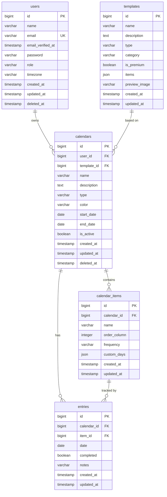

# Database Schema Examples

Concrete examples supporting `../SKILL.md`. Uses a hypothetical "Calendar"
app domain; adapt table/column names to the actual project.

## Entity inventory example

### users
Primary user table. Managed by the framework's auth system.

| Column | Type | Nullable | Default | Notes |
|--------|------|----------|---------|-------|
| id | bigIncrements | No | auto | Primary key |
| name | string(255) | No | - | Display name |
| email | string(255) | No | - | Unique, login credential |
| email_verified_at | timestamp | Yes | null | Verification timestamp |
| password | string(255) | No | - | Hashed |
| role | string(50) | No | 'user' | user, admin |
| timezone | string(100) | Yes | 'UTC' | User's timezone |
| remember_token | string(100) | Yes | null | Session remember |
| created_at | timestamp | Yes | null | |
| updated_at | timestamp | Yes | null | |
| deleted_at | timestamp | Yes | null | Soft delete |

### calendars
User-created resources (example entity).

| Column | Type | Nullable | Default | Notes |
|--------|------|----------|---------|-------|
| id | bigIncrements | No | auto | Primary key |
| user_id | bigInteger (unsigned) | No | - | FK -> users.id |
| template_id | bigInteger (unsigned) | Yes | null | FK -> templates.id |
| name | string(255) | No | - | Calendar title |
| description | text | Yes | null | Optional description |
| type | string(50) | No | - | daily, weekly, monthly, yearly |
| color | string(7) | Yes | '#4A90D9' | Hex color code |
| start_date | date | No | - | Calendar start |
| end_date | date | Yes | null | Calendar end (null = ongoing) |
| is_active | boolean | No | true | Active/archived |
| created_at | timestamp | Yes | null | |
| updated_at | timestamp | Yes | null | |
| deleted_at | timestamp | Yes | null | Soft delete |

### calendar_items
Individual trackable items within a calendar.

| Column | Type | Nullable | Default | Notes |
|--------|------|----------|---------|-------|
| id | bigIncrements | No | auto | Primary key |
| calendar_id | bigInteger (unsigned) | No | - | FK -> calendars.id |
| name | string(255) | No | - | Item name (e.g. "Meditation") |
| order | integer | No | 0 | Display order |
| frequency | string(50) | No | 'daily' | daily, weekdays, weekends, custom |
| custom_days | json | Yes | null | [0,1,2,3,4,5,6] for custom |
| created_at | timestamp | Yes | null | |
| updated_at | timestamp | Yes | null | |

### entries
Daily completion records for calendar items.

| Column | Type | Nullable | Default | Notes |
|--------|------|----------|---------|-------|
| id | bigIncrements | No | auto | Primary key |
| calendar_id | bigInteger (unsigned) | No | - | FK -> calendars.id |
| item_id | bigInteger (unsigned) | No | - | FK -> calendar_items.id |
| date | date | No | - | The date of the entry |
| completed | boolean | No | false | Completion status |
| notes | string(500) | Yes | null | Optional notes |
| created_at | timestamp | Yes | null | |
| updated_at | timestamp | Yes | null | |

### templates
Pre-built calendar templates.

| Column | Type | Nullable | Default | Notes |
|--------|------|----------|---------|-------|
| id | bigIncrements | No | auto | Primary key |
| name | string(255) | No | - | Template name |
| description | text | Yes | null | Template description |
| type | string(50) | No | - | daily, weekly, monthly, yearly |
| category | string(100) | No | - | fitness, health, productivity, etc |
| is_premium | boolean | No | false | Requires subscription |
| items | json | No | - | Array of item definitions |
| preview_image | string(500) | Yes | null | Storage path |
| created_at | timestamp | Yes | null | |
| updated_at | timestamp | Yes | null | |

## Relationship map example

| Parent | Child | Type | FK Column | On Delete | Notes |
|--------|-------|------|-----------|-----------|-------|
| users | calendars | 1:N | calendars.user_id | CASCADE | User owns calendars |
| templates | calendars | 1:N | calendars.template_id | SET NULL | Template is optional |
| calendars | calendar_items | 1:N | calendar_items.calendar_id | CASCADE | Items belong to calendar |
| calendars | entries | 1:N | entries.calendar_id | CASCADE | Entries belong to calendar |
| calendar_items | entries | 1:N | entries.item_id | CASCADE | Entry tracks one item |
| users | subscriptions | 1:1 | subscriptions.user_id | CASCADE | Billing-provider managed |

### Pivot tables (N:N)

| Table | Left FK | Right FK | Extra Columns | Notes |
|-------|---------|----------|---------------|-------|
| calendar_shares | calendar_id | shared_with_user_id | permission (view/edit), created_at | Sharing calendars |

## Index definitions example

| Table | Index Name | Columns | Type | Purpose |
|-------|-----------|---------|------|---------|
| users | users_email_unique | email | UNIQUE | Login lookup |
| calendars | calendars_user_id_index | user_id | INDEX | List user's calendars |
| calendars | calendars_type_index | type | INDEX | Filter by type |
| calendars | calendars_user_is_active | user_id, is_active | COMPOSITE | Active calendars query |
| calendar_items | calendar_items_calendar_id_index | calendar_id | INDEX | Items for a calendar |
| calendar_items | calendar_items_calendar_order | calendar_id, order | COMPOSITE | Ordered items |
| entries | entries_calendar_id_index | calendar_id | INDEX | Entries for a calendar |
| entries | entries_item_id_index | item_id | INDEX | Entries for an item |
| entries | entries_date_index | date | INDEX | Filter by date |
| entries | entries_calendar_date | calendar_id, date | COMPOSITE | Calendar entries by date |
| entries | entries_item_date_unique | item_id, date | UNIQUE | One entry per item per day |
| templates | templates_category_index | category | INDEX | Browse by category |
| templates | templates_type_index | type | INDEX | Filter by type |

## ER diagram example (Mermaid)



Validate the diagram renders correctly via the Mermaid MCP tool.

## Migration execution order example

| Order | Migration | Dependencies | Notes |
|-------|-----------|-------------|-------|
| 1 | create_users_table | None | Framework default (may already exist) |
| 2 | create_templates_table | None | No FKs to other custom tables |
| 3 | create_calendars_table | users, templates | FK to users.id, templates.id |
| 4 | create_calendar_items_table | calendars | FK to calendars.id |
| 5 | create_entries_table | calendars, calendar_items | FK to calendars.id, calendar_items.id |
| 6 | create_calendar_shares_table | calendars, users | Pivot table |

Migration file naming convention: `YYYY_MM_DD_HHMMSS_create_tablename_table.php`
(Laravel) or the equivalent timestamped convention for the project's stack.

## Soft delete strategy example

| Table | Soft Delete | Reason |
|-------|-------------|--------|
| users | Yes | Account recovery, GDPR compliance |
| calendars | Yes | User may want to restore |
| calendar_items | No | Cascade with calendar |
| entries | No | Cascade with calendar |
| templates | No | Admin-managed, hard delete OK |
| subscriptions | No | Billing-provider managed |

Cascade rules: when a calendar is soft-deleted, its items and entries remain
but are inaccessible via the calendar relationship; when a user is
soft-deleted, their calendars are soft-deleted via model events; hard deletes
only via admin action with explicit approval.

## Migration code example (Laravel Blueprint)

```php
Schema::create('calendars', function (Blueprint $table) {
    $table->id();
    $table->foreignId('user_id')->constrained()->cascadeOnDelete();
    $table->foreignId('template_id')->nullable()->constrained()->nullOnDelete();
    $table->string('name', 255);
    $table->text('description')->nullable();
    $table->string('type', 50); // daily, weekly, monthly, yearly
    $table->string('color', 7)->default('#4A90D9');
    $table->date('start_date');
    $table->date('end_date')->nullable();
    $table->boolean('is_active')->default(true);
    $table->timestamps();
    $table->softDeletes();

    // Indexes
    $table->index('user_id'); // Already created by foreignId
    $table->index('type');
    $table->index(['user_id', 'is_active']);
});
```
