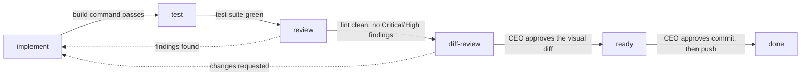
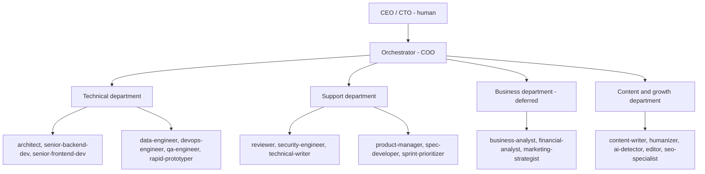

# Agentry

*"It's a tool dude"*

Agentry is a deterministic orchestration harness for Claude Code. A team of 31
role agents (architect, backend, frontend, QA, reviewer, security, writer, and
more) is driven through a gated finite state machine whose transitions are
recorded by Python hooks and SQLite, not decided by the model.


## Table of contents

- [What it is](#what-it-is)
- [How it works](#how-it-works)
- [Requirements](#requirements)
- [Install and first run](#install-and-first-run)
- [Usage](#usage)
- [The agent roster](#the-agent-roster)
- [Configuration](#configuration)
- [Roadmap](#roadmap)
- [License](#license)

## What it is

Autonomous agent runs share three failure modes: they drift from the plan
over a long session, they self-certify work as done based on their own
say-so, and they lose context between one task and the next. Agentry is a
set of Claude Code agents, rules, and Python hooks built to stop those three
things specifically:

- **Deterministic gates.** A task moves from one pipeline stage to the next
  only when `tools/pipeline/advance.py` runs the stage's real exit command
  (build, test, lint) and reads a real exit code. The model proposes that a
  stage is done; only the script records the transition, in
  `.claude/state/run.db`.
- **Folder-as-state task tracking.** A task's status is the directory its
  file sits in - `.claude/tasks/backlog/`, `active/`, or `done/`. There is no
  `status:` field to drift out of sync with reality.
- **Forced context handoff.** Before a new task can start, the previous
  completed task must have a handoff document in `.claude/tasks/handoffs/`,
  written by the next task's own assignee from the merged diff and the gate
  log. `advance.py` and the `Stop` hook both refuse to proceed without it, so
  reading the prior task's decisions is not optional.

The Claude Code `PreToolUse`, `Stop`, `SubagentStart`, and `SubagentStop`
hooks wire this into every session: they deny writes outside an agent's
declared scope, block `git commit` and `git push` until a human has recorded
approval, and keep the orchestrator moving through the backlog without
asking "should I continue?" at every step.

## How it works

### The build pipeline

Every implementation task travels the same six stages. Each arrow is a real
exit-gate command, not an agent's opinion.



`diff-review` opens a side-by-side diff in the browser, where the CEO approves
or sends the task back with inline comments. It is on its way out: Claude Code
now ships a built-in `/diff`, so the stage and its tool are removed in the
current epic and the diff moves to the commit checkpoint.

`implement`, `test`, and `review` are editing stages: only one task occupies
one at a time, so there is never a concurrent edit to the working tree. `done`
is reached only when git confirms the branch is actually merged into the main
branch, not merely pushed.

### Department structure



The orchestrator never writes code or documents outside `.claude/`, `docs/`,
and root `README`/`CLAUDE.md` files. That is enforced by the
`orchestrator_gate` block in `pipeline.json`, checked on every tool call by
`pretool_gate.py` - dispatching the owning agent is the only path to a code
change.

## Requirements

- **Claude Code**, with hooks and subagent dispatch (`SessionStart`,
  `PreToolUse`, `Stop`, `SubagentStart`, `SubagentStop`, `PreCompact`,
  `PostToolUse` are all wired in `.claude/settings.json`).
- **Python 3.12 or newer** on PATH. The scripts themselves parse on 3.9, but
  the project targets current stable releases and is only tested there. Every
  script under `.claude/tools/` is standard-library only (`json`, `sqlite3`,
  `subprocess`, `re`, `time`) at runtime, so no `pip install` step exists or is
  needed to run the harness.
- **git**, for branch checks, merge detection, and the commit/push
  checkpoints.
- **ruff** (development dependency only, not needed at runtime): lints
  `.claude/tools` as the `review` stage's exit gate. Config lives in the root
  `pyproject.toml`. Install with `pip install ruff` or any package manager;
  the harness itself never imports it.
- **codegraph MCP server** (optional). Wired per project in the root
  `.mcp.json` (`codegraph serve --mcp`). It indexes code into `.codegraph/`
  at the project root for fast structural queries; the harness runs without
  it, falling back to `Grep`/`Glob`.

## Install and first run

There is no package or plugin yet. Installing Agentry today means copying
the template directory into your project and running the onboarding prompt:

1. Copy `.claude/` and the root `CLAUDE.md` into your project (back up any
   existing `CLAUDE.md` first).
2. Open Claude Code at the project root.
3. Paste the prompt from `.claude/_init-prompt.md`. It runs two phases:
   Phase A auto-detects your stack (language, framework, test/format/build
   commands, database, CI) and fills `.claude/project/stack.md` and the
   `{{PLACEHOLDER}}` tokens across `.claude/`; Phase B is an interactive
   interview that configures `.claude/pipeline.json` (stages, exit-gate
   commands, retry budget, checkpoint automation) with you.
4. Follow `.claude/_onboarding.md` for anything Phase A/B did not cover:
   optional rules (`i18n`, `mobile`, `business-standards`), permissions in
   `settings.json`, and the codegraph `init`/`status` check.

**Read section 2 of `.claude/_onboarding.md` before you trust the gates.** This
repository is both the template and a live project, so its `pipeline.json` ships
with Agentry's own values rather than `{{PLACEHOLDER}}` tokens. Searching for
leftover `{{...}}` will therefore find nothing, while four keys still need your
values: `main_branch` and the exit-gate commands of `implement`, `test` and
`review`. Inherit them unchanged and your implement gate lints this harness
instead of building your code, which passes and proves nothing. Section 2 lists
each key with the value you inherit and the placeholder it replaced.

A plugin-based install (`${CLAUDE_PLUGIN_ROOT}` addressing, marketplace
manifest) is planned - see [Roadmap](#roadmap) - and is not shipped today.

## Usage

### Modes and approval levels

`.claude/state/mode` picks which pipeline a newly registered task follows:

| Mode | Pipeline |
|---|---|
| `build` | `implement -> test -> review -> diff-review -> ready -> done` |
| `plan` | `formalize -> draft -> plan-review -> approval -> breakdown -> done` |
| `talk` | no pipeline registration |

`.claude/state/approvals` picks how many checkpoints pass without asking you:

| Level | Behavior |
|---|---|
| `manual` | every checkpoint waits for you: which task to take, the diff, the commit |
| `assisted` | taking a task and committing pass unasked; a clean code review skips the diff review |
| `auto` | the above, plus taking the next ready task when the current one parks |

Two things no level ever grants, whatever `pipeline.json` says: **the push** and
**merging into the main branch**. `approvals.NEVER_GRANTED` refuses the push
before the level and before any per-stage `auto_approve` entry is consulted, so
a config key cannot re-grant it. The merge happens in the web UI and the harness
never performs it at all.

### The daily loop

```bash
# Check what is running
python .claude/tools/pipeline/state.py --show

# Start a task (creates/records the run; branch must already be cut from up-to-date main)
python .claude/tools/pipeline/advance.py --task task-0001 --type feature

# After the CEO reviews the diff and approves:
python .claude/tools/pipeline/approve.py --task task-0001 --gate commit
git commit -m "..."
python .claude/tools/pipeline/advance.py --task task-0001

python .claude/tools/pipeline/approve.py --task task-0001 --gate push
git push
python .claude/tools/pipeline/advance.py --task task-0001
```

Between the start of a task and its three checkpoints (the visual diff review,
the commit, the push), the
orchestrator drives it without asking to continue: the `Stop` hook
(`stop_gate.py`) blocks the session from ending while any task is
advanceable or a ready backlog task remains, and reconciles a task's folder
against git and `run.db` state before it allows an idle stop. A `blocked`
task (gate failed past the retry budget) is surfaced to you; it is never
retried on its own.

New tasks are written into `.claude/tasks/backlog/` (`skills/new-task`).
`advance.py` moves a task's file `backlog/ -> active/` when it registers,
and `active/ -> done/` only once `git_state.py` confirms the branch is
merged into the main branch.

## The agent roster

| Agent | Profile | Dispatch when |
|---|---|---|
| architect | readonly | planning a feature/system, DB schema, API contract decisions |
| senior-backend-dev | dev | backend feature, bugfix, refactor, migration |
| senior-frontend-dev | dev | web/mobile UI feature, component work |
| data-engineer | dev | data pipelines, ETL, warehouse schemas, data quality |
| devops-engineer | dev | containers, CI/CD, deploy, infrastructure |
| qa-engineer | dev | writing/running the test suite, quality gates |
| rapid-prototyper | dev | throwaway MVP/spike to validate an idea fast |
| reviewer | readonly | code/architecture review, before QA sign-off |
| security-engineer | readonly | security audit, threat model, vulnerability review |
| performance-benchmarker | readonly | load tests, performance baselines and regressions |
| accessibility-auditor | readonly | WCAG/a11y audit of UI work |
| evidence-collector | readonly | screenshots/log proof of UI behavior during review |
| incident-response-commander | readonly | production incident triage, post-mortems |
| technical-writer | docs | documentation, API docs, changelog after phases |
| ux-ui-designer | docs | wireframes, user flows, design review |
| ux-researcher | docs | user interviews, surveys, usability findings |
| spec-developer | docs | writing the spec from the architect's plan |
| product-manager | docs | epic + task decomposition from an approved spec |
| sprint-prioritizer | docs | ordering the backlog, status reporting |
| feedback-synthesizer | docs | consolidating user/CEO feedback into themes |
| business-analyst | docs | market research, business plan, requirements analysis (deferred) |
| financial-analyst | docs | financial models, unit economics, pricing, runway (deferred) |
| marketing-strategist | docs | GTM strategy, channels, launch planning (deferred) |
| brand-guardian | docs | brand consistency review of outward-facing assets (deferred) |
| content-manager | docs | content strategy, editorial calendar, briefs |
| content-writer | docs | drafting copy from briefs, runs before humanizer |
| humanizer | docs | de-AI-ifying prose, runs after content-writer |
| ai-detector | readonly | AI-slop verdict on prose, after humanizer, before reviewer |
| editor | docs | line/copy edit, factual integrity, terminology |
| seo-specialist | docs | technical + on-page SEO, keyword strategy |
| geo-specialist | docs | generative engine optimization (AI answer citations) |

`dev` agents can edit code but cannot approve their own checkpoints or run
the full test suite standalone. `readonly` agents can read and run
non-mutating commands but cannot Edit or Write. `docs` agents can write only
under `.claude/`, `docs/`, and root README/CLAUDE files. Every profile is
enforced inside the subagent itself via `agent_gate.py`, wired in each
agent's frontmatter `hooks.PreToolUse` - not left to the prompt.

## Configuration

`.claude/pipeline.json` declares the two pipelines (`build`, `plan`): their
stages, the owning agent per stage, allowed tools, the exit-gate command, the
retry budget, the continuation ceiling, the main branch name, and which
checkpoints (if any) are auto-approved. It also carries the `handoff` block
(baseline, whether an edit freeze applies while handoff debt exists) and the
`memory` block (baseline for the post-task memory-review gate).

`.claude/project/` is the per-project overlay a new adopter fills in during
onboarding:

| File | Content |
|---|---|
| `project-context.md` | product, domain terminology, features, phase activation |
| `architecture.md` | module/folder layout, dependency rules |
| `api-conventions.md` | framework-specific controller/validator/resource patterns |
| `stack.md` | language, framework, test/format/lint/build commands, env vars, routes - the source of truth for every `{{PLACEHOLDER}}` token elsewhere in `.claude/` |

If `project/` is empty or still full of `[PROJECT-SPECIFIC - REPLACE ME]`
markers, the template has not been onboarded to that project yet.

## Roadmap

Sourced from `.claude/plans/2026-09-12-harness-overhaul-plan.md`.

- Cut preloaded context per dispatched agent from roughly 145k tokens to
  under 40k (character-budgeted memory injection, tagged lessons, split
  rules).
- Fix the stop-gate continuation counter so any blocking branch is bounded,
  not only editing stages.
- Multi-repo lanes: a `repos{}` map in `pipeline.json`, per-repo gates, and
  backlog filtering so two lanes stop competing for the same queue.
- Human checkpoints routed through `AskUserQuestion` instead of plain chat
  text, plus visible hook output (terminal alert, status line).
- Package the harness as a Claude Code plugin (`${CLAUDE_PLUGIN_ROOT}`
  addressing, marketplace manifest) once the above stops moving.

## License

No license has been chosen yet. Until one is added, all rights are reserved
by the repository owner.
